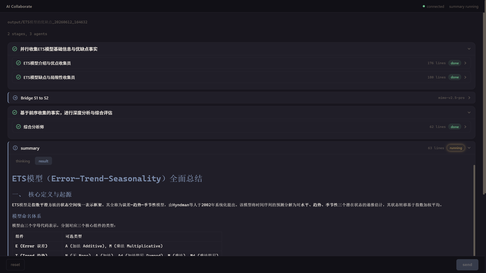

# AI Collaborate

[English](README.md) | [简体中文](README_zh.md)

多智能体 LLM 编排框架，支持自动规划、并行分派和综合汇总。

## 预览



多智能体分阶段并行处理界面。

## 项目结构

```text
├── orchestrator.py                  # 主控程序：规划 -> 分派 -> 循环（或单次执行）
├── run_web.py                       # Web 界面启动器
├── mini_panel.py                    # 精简版多智能体链路（无规划器）
├── config/                          # 配置文件
│   ├── orchestrator.json            # 编排器配置（已 gitignore）
│   ├── orchestrator_example.json    # 编排器配置示例
│   ├── mini_panel.json              # mini_panel 配置（已 gitignore）
│   └── mini_panel_example.json      # mini_panel 配置示例
├── proposal/                        # 设计提案
├── lib/
│   ├── client.py                    # LLM 客户端封装
│   ├── planner.py                   # 规划解析 + Schema 校验
│   ├── dispatcher.py                # 分阶段分派执行器
│   ├── context.py                   # 上下文构建器（循环模式）
│   ├── summarizer.py                # 最终综合汇总
│   ├── broadcaster.py               # SSE 事件总线
│   ├── constants.py                 # 共享状态常量
│   ├── log.py                       # 日志工具
│   └── safe_name.py                 # 文件名安全处理
├── web/
│   ├── server.py                    # HTTP + SSE 服务器（仅使用标准库）
│   ├── runner.py                    # Web 执行器（复用 lib 模块）
│   ├── index.html                   # 单页 UI
│   └── static/                      # marked.js、KaTeX（本地资源）
└── output/                          # 所有运行输出（已 gitignore）
```

## 安装配置

1. 复制示例配置文件并去掉 `_example` 后缀：

   ```bash
   cp config/orchestrator_example.json config/orchestrator.json
   # 或
   cp config/mini_panel_example.json config/mini_panel.json
   ```

2. 打开复制的文件，填入你的 API Key 和其他设置。

## 使用方法

```bash
# 编排器（带规划的多智能体模式）
python orchestrator.py

# 编排器单次模式（无交互式 REPL）
python orchestrator.py --no-interactive "你的目标描述"

# mini_panel（精简版多智能体链路）
python mini_panel.py

# Web 界面
python run_web.py
# 打开 http://localhost:8080
```

## 核心设计

**分阶段分派。** 同阶段的智能体并行运行；各阶段顺序执行。后续阶段可以看到前面阶段的上下文。阶段数量和每阶段智能体数量不限——规划器决定合适的分解深度。分派在后台线程中运行，因此交互循环立即启动——执行期间 `/status` 命令可用。

**桥接上下文。** 在各阶段之间，一次轻量级 LLM 调用（通过 `pipeline.bridge` 配置）读取所有前序阶段的输出，为下一阶段生成聚焦的上下文摘要。桥接输出保存到磁盘并记录在 `state.json` 中。如果没有桥接配置，则回退到简单截断。

**状态生命周期。** 每次运行经历四个状态：`pending` -> `running` -> `done` / `error`。状态持久化到 `state.json`（包括 `status`、`summary_status`、`summary`、`continues`），因此 Web UI 在页面刷新和服务器重启后均可恢复。`/status` 显示计数、每个智能体的标记（`+` 完成、`-` 运行中、`!` 错误、空格待执行）以及后续问题。

**错误隔离。** 单个智能体的 API 故障被捕获并标记为 `error`——不会污染桥接上下文或摘要。如果某阶段所有智能体都失败，流水线将停止以避免浪费下游调用。规划失败（3 次重试耗尽）会干净退出，不进入交互循环。

**带重试的规划校验。** 规划器输出解析为严格 JSON 并进行校验（必填字段、模型池成员、值范围）。失败时，具体错误会以对话方式反馈，最多重试 3 次。

**人性化措辞。** 所有提示词使用人类术语——同事，而非"AI 智能体"。智能体接收任务时不知道发送者是另一个模型，保持输出的角色适当性。

## Web 界面

`python run_web.py` 启动 HTTP 服务器（默认端口 8080，可通过配置中的 `web_port` 修改）。在底部输入栏输入目标——与 CLI 相同的工作流，以可折叠卡片形式展示。内容从本地磁盘文件读取（非 SSE 分块），更加可靠。Markdown 和 TeX（`$...$` / `$$...$$`）通过内置的 marked.js 和 KaTeX 渲染。原始 CLI（`orchestrator.py`）不受影响。

**统一卡片系统。** 阶段、智能体、桥接、摘要、后续共用一个 CSS 卡片基础样式和变体修饰符。所有图标均为内联 SVG（16x16，描边风格）——无 emoji。四种状态（完成/运行中/错误/待执行）各有不同的 SVG 形状和协调动画。

**状态恢复。** `state.json` 是唯一的数据源。页面刷新恢复所有卡片、后续问题和摘要。空状态显示可点击的历史列表（`/api/runs`）。加载历史运行记录会恢复完整视图，包括摘要和后续提问功能。

**后续提问（continue）。** 摘要完成后，可输入后续问题。一个后续卡片会立即出现并流式展示内容。后续条目持久化到 `state.json`，拥有独立的状态生命周期。
